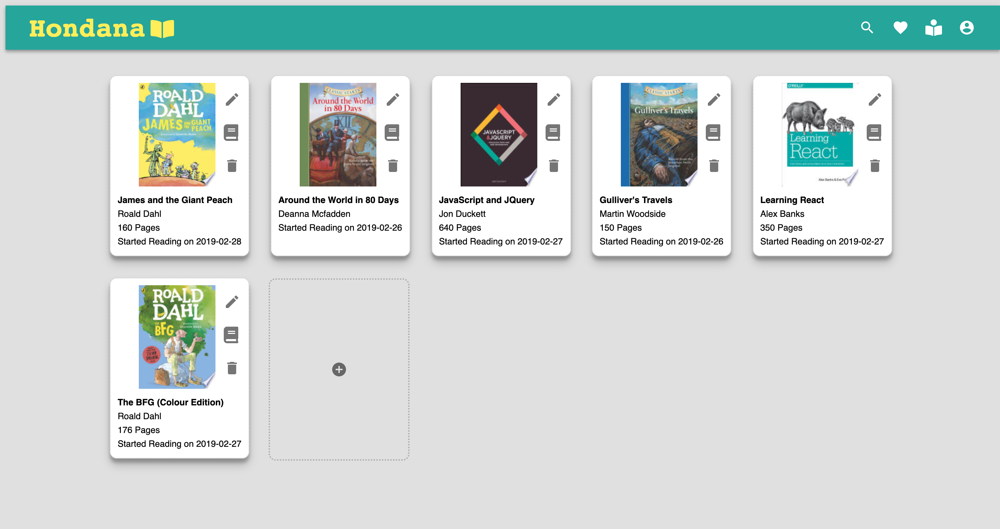
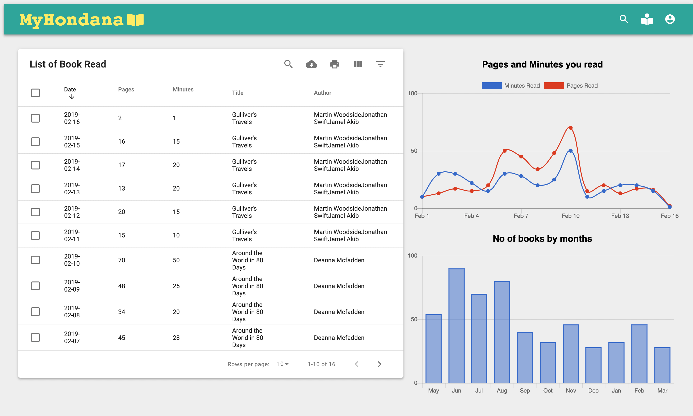

## MyHondana: My Bookshelf

<h3> Main Page</h3>

<h3> Table Page</h3>

### Features

- Keep track of books that you read
- Keep track of the pages and the minutes that you read
- Show the movements on graph

### What I used to code?

[ Front-end ]

- React
- Redux
- Material-ui
- CSS, FontAwesome
- Chartkick
- mui-datatables

[ Back-end ]

- Axios
- Redux Thunk

[ API ]
Google Book API

[ Database]
Firebase

## My biggest challenge

This project was difficult to start with due to lack of my knowledge especially on Redux. Luckily, I was able to find many websites which shows same project in React/Redux. So I started learning by looking at those references. On the second day, I found myself that I was just copying those code and not understanding Redux.

So I decide to re-start from fresh. I stopped thinkin and planning on Actions and Reducers and started coding with React where I felt comfortable with. Then there was a moment that I had to lift up the state, and I knew it was my time to implement Redux.

I was not clear on "mapStateToProps" and "mapDispatchToProps" at first. After spending good amount of time on debugging mainly on Action not passing value to State, I now feel much comfortable with Redux.

My other challenge was Material-ui. I like their Icon buttons and I enjoyed reading their samples code as I was able to learn about defining classNames first on top to make it easier when re-using components. However, it was more complecated and I ended up stying with CSS a lot as I like it and I am familiar with it.

## Remaining Tasks

- Delete Function (DailyLog)
- Edit Function (DailyLog)
- Monthly graph
- Authentication (Login, Logout)
